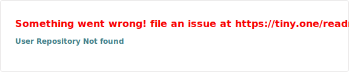

 
 

  
  
  

---

### 📊 GitHub Metrikleri

  
  &nbsp;
  
  &nbsp;
  

### 🏆 Başarılar

  

### 📈 Katkı Grafiği

  

---

### 🛠️ Teknoloji Stack'im

*Diller, framework'ler ve araçlar*

<table>
<tr>
<td align="center" width="33%">

**💻 Diller**

</td>
<td align="center" width="33%">

**🎨 Frontend & Mobil**

</td>
<td align="center" width="33%">

**⚙️ Backend & Veritabanı**

</td>
</tr>
<tr>
<td colspan="3" align="center">

**🤖 AI, Araçlar & Cloud**

</td>
</tr>
</table>

 

---

### 🔥 Öne Çıkan Projeler

  
  

---

### 📬 İletişim

  
  
  
  

---

### 🐍 Katkı Haritası

<picture>
  <source media="(prefers-color-scheme: dark)" srcset="https://raw.githubusercontent.com/suleymantaha/suleymantaha/output/github-contribution-grid-snake-dark.svg">
  <source media="(prefers-color-scheme: light)" srcset="https://raw.githubusercontent.com/suleymantaha/suleymantaha/output/github-contribution-grid-snake.svg">
  
</picture>

---

  

